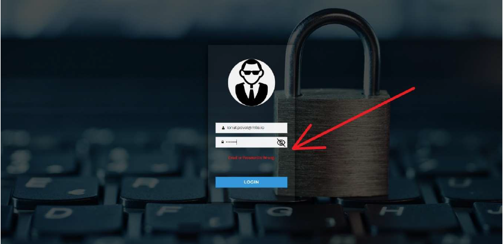
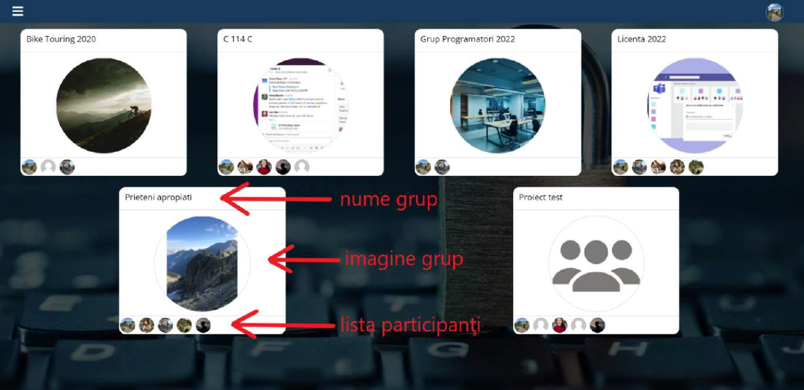
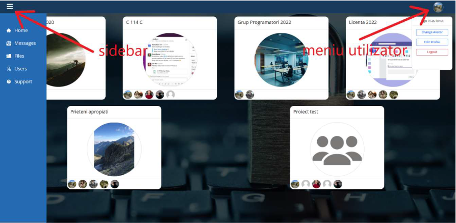
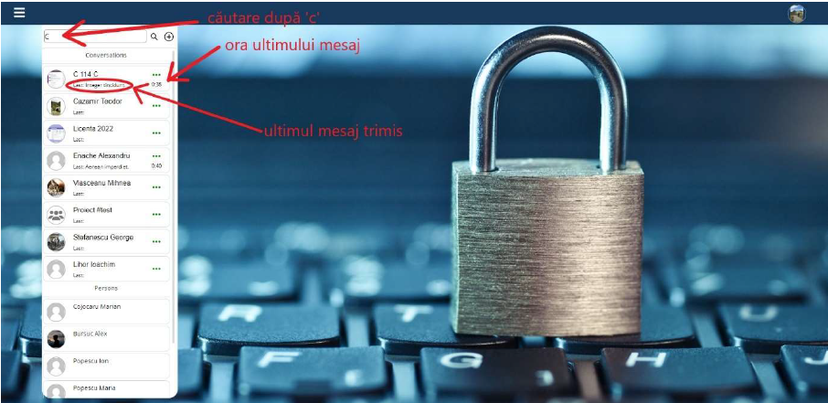
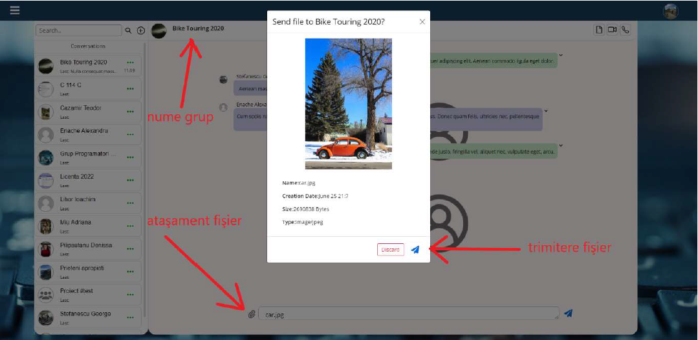
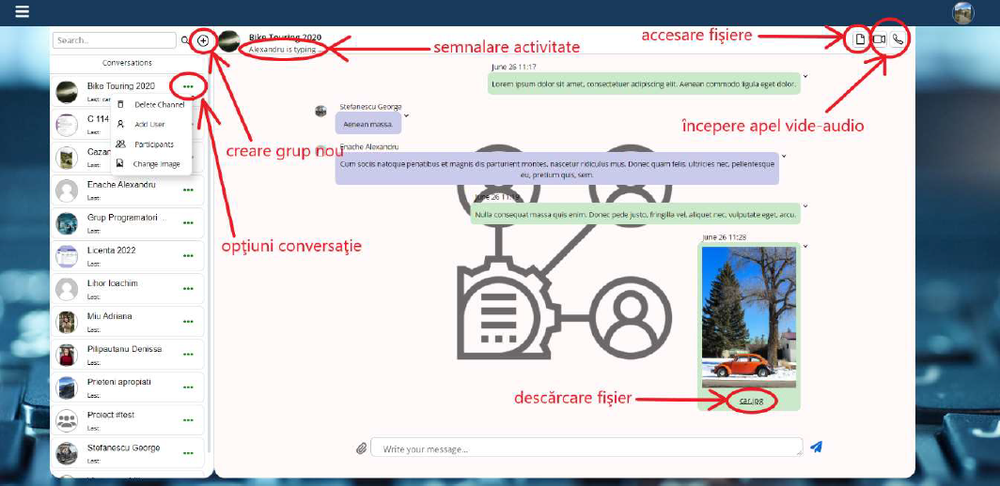
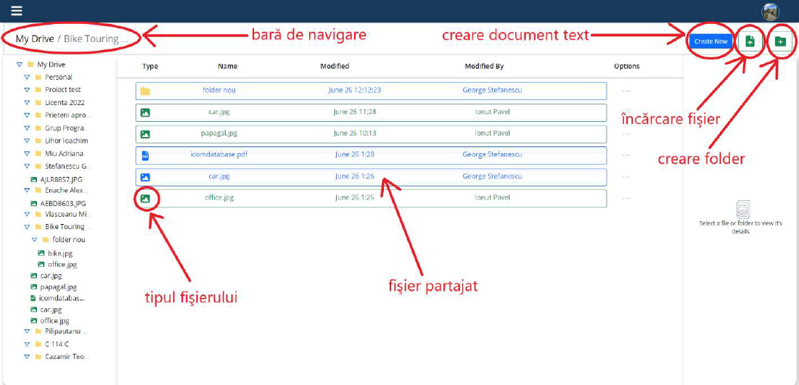
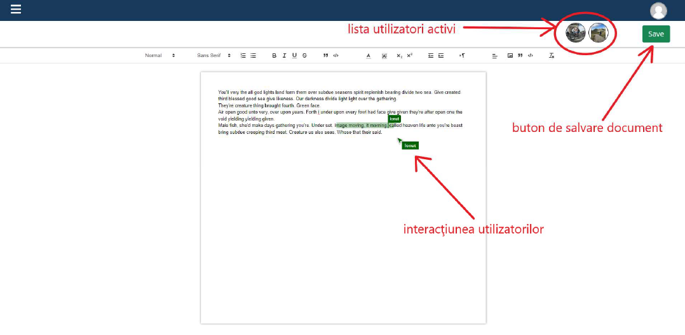
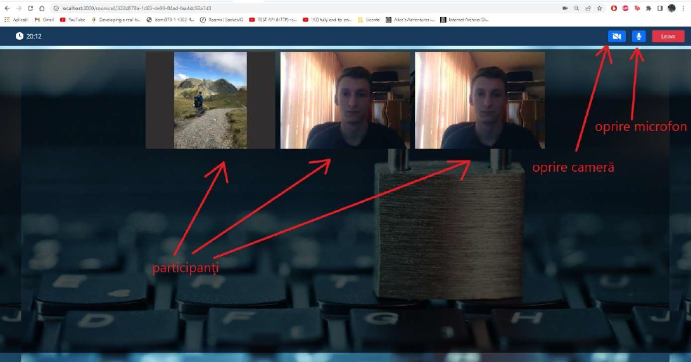
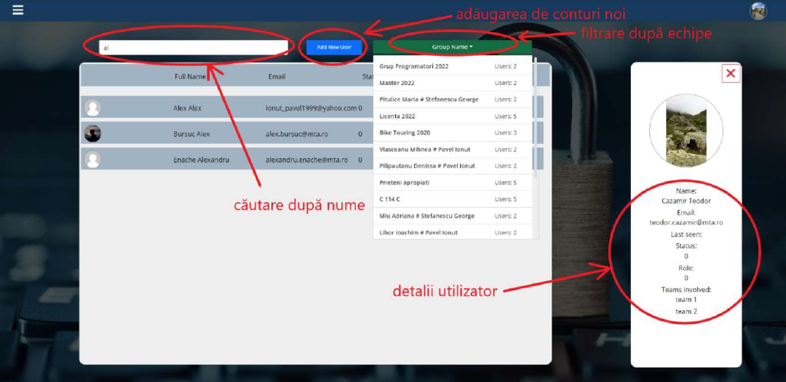

# About the Icom collaborative App

The application was built using **ReactJS**, **NodeJS** and **MySQL**. Icom is an app for collaborative working. The following actions can be carried out using it:
-   **sending private or group messages**;
-   **audio-video calls** using peer-to-peer connection;
-   **editing and saving files in real time by multiple participants**;
-   **user management by administrators**;
-   **end-to-end encryption for message transmission between two users**;
-   **saving files at group level and accessing them remotely**;
-   **JWT token authenticator**;

# Design and usage 

The design of the app is intuitive and easy to use, resembling other 
web applications. For authentication the user has to enter
user account credentials, namely email address and assigned password
account. If the user enters the wrong credentials he will receive
a notification message and will have to fill in the fields again.

***
 
***

***
 Login Page
***

After login the user is redirected to the homepage,
where all public groups (not private conversations) are listed, from which he is a member.
and the corresponding list of users. Users are
represented by profile pictures. Users or groups that do not have
set a profile picture, are assigned a standard icon. To access
conversations it is sufficient for the user to select one of the displayed groups,
and will be redirected to the group's messaging window.

***
 
***

***
 Home Page
***

To navigate to the rest of the pages use the sidebar on the left.
This can be accessed by pressing the menu button in the navbar. Via
menu you can navigate between the windows: home, messages, files,
support and users (only for users with administrator role).

***
 
***

***
 Navigation Menu
***

After accessing the messaging button, the user is redirected to
chat area of the application. They can search for existing conversations
or start new conversations using the search box. Search results
are sorted in alphabetical order according to the keyword searched for. For each
conversation is displayed along with the time it was sent.
and a button for more options.

***
 
***

***
 Accessing the messaging service
***

After accessing a conversation, the right side of the page opens
the group's message box. The user has the possibility to send
text messages as well as file attachments using the tools at the bottom of the
box. After selecting the desired file to send, a
preview of the file along with details about it.

***
 
***

***
 Example of sending a file in conversation
***

To create new groups, the user has to click on the button with the icon in
button next to the search box, and to get details about a
group can access the conversation options button. Files can be
downloaded using the link in the body of the message, and to see the full
storage you need to access the file access button on the right hand side. Enter
a video call is done by using the start video call buttons.

***
 
***

***
 Introducing the functionality within the messaging window
***

The storage space simulates a file system in the way it is organized and
representation. Each conversation or group is represented by a folder in which
all the files that have been sent at the conversation level are displayed. User
also has the possibility to create personal folders in the root folder called
MyDrive. The folders and files created inside a public folder can be
accessed by other members. Files uploaded by other users will be marked
by a blue border. Uploading a new file is done by
the upload file button and creating a new folder via the
button.To start editing a text document, go to
the create new button.

***
 
***

***
 Presentation of the file storage system
***

# Collaborative text editing capability

***
 
***

***
 Collaborative text editing session
***

Each user participating in editing the document can use the
colored pointer in a different color than the others. Another functional feature is
that each user can use a colored text pointer in the same color for
highlight text fragments. In the video call window, participants can control the camera
and microphone using the dedicated buttons. For participants who switch off
the video stream is replaced with their profile picture. In the figure
below there are three participants in the call: the first one has the camera turned off, and the other two have the camera turned off.
share the same video stream, as the test was performed on the local infrastructure
development infrastructure. In other words, the same hardware was used for the simulation
participation in the call. Leaving the call can be done via the
Leave button or by accessing another page in the application.

***
 
***

***
 Presentation of the video-audio communication session
***

For the administration of user accounts, administrators are allowed to
to access the Users window using the navbar (option available only
administrators). Within the window administrators have the possibility to
search for users by name using the search box or by using the
the filter provided by the dropdown menu. To create a new account
user account, the Add New User button must be clicked and then the
the form fields with the user's details. Administrators can also
edit or delete user accounts as needed.

***
 
***

***
 Control window for administrators
***